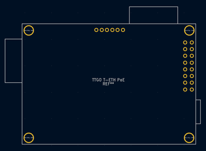

A KiCad 6 footprint and symbol for the TTGO T-ETH (also known as T-Internet) PoE ESP32 board.

Pin definitions:

|Programming Header (left to right)|
|------------------|
|1 - TX            |
|2 - RX            |
|3 - IO0           |
|4 - RST           |
|5 - GND           |
|6 - 3V3           |

|Main Header|     |
|----------|----------|
|7 - IO36  |15 - IO39 |
|8 - IO34  |16 - IO35 |
|9 - IO16  |17 - IO32 |
|10 - IO33 |18 - IO12 |
|11 - IO04 |19 - IO15 |
|12 - IO02 |20 - IO14 |
|13 - 3V3  |21 - GND  |
|14 - 3V3  |22 - GND  |
